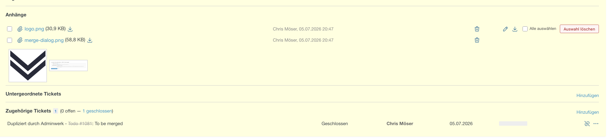

# redmine_attachment_bulk_delete

*[Deutsche Version](README_de.md)*

Single and bulk deletion of attachments in Redmine 6.1.x – in two places:

1. **Issue view, "Attachments" section** – checkbox per attachment + button
   **"Delete selected"** (a single-item trash icon was already there).
2. **Attachment edit page** `/attachments/<type>/<id>/edit` – previously only
   renaming; now also checkboxes, **"Delete selected"** and a
   **trash icon per row**.

Works generically for wiki pages, forums, documents, projects, versions and news as well (anywhere Redmine offers attachments and the "Edit" link).

## How it works (short version)

- **No core override.** The plugin only adds its own controller (`AttachmentBulkController`) + one route (`POST /attachments/bulk_destroy`) and enhances the existing views via JavaScript (`view_layouts_base_html_head` hook). This keeps it upgrade-safe.
- **Permissions** are checked server-side as the final authority:
  - Issues via the regular Redmine path
    (`safe_attributes = {'deleted_attachment_ids' => ...}` + `save`), i.e. identical to the normal edit form. Requires `edit_issues` (or `edit_own_issues` as author).
  - Other containers via `attachment.deletable?`.
- **History stays correct:** one journal entry per deletion, with one "File deleted" detail per attachment.
- The JavaScript only shows the buttons where the "Edit" link is present (= permission exists) – fail-closed.



## Installation

```bash
cd ./plugins
git clone https://github.com/admnwrk/redmine_attachment_bulk_delete.git
```

In a Docker Compose setup: place the folder in the plugins volume and restart the `hitredmine` container. There is **no migration**.
Assets are automatically copied by Redmine on startup to `public/plugin_assets/redmine_attachment_bulk_delete/`.

## Configuration / Customization

- UI texts (German) are centralized in the `T` object at the top of `assets/javascripts/attachment_bulk_delete.js`.
- Allowed container types: constant `ALLOWED_CONTAINERS` in the controller.

## Version

1.0.0 Initial version
